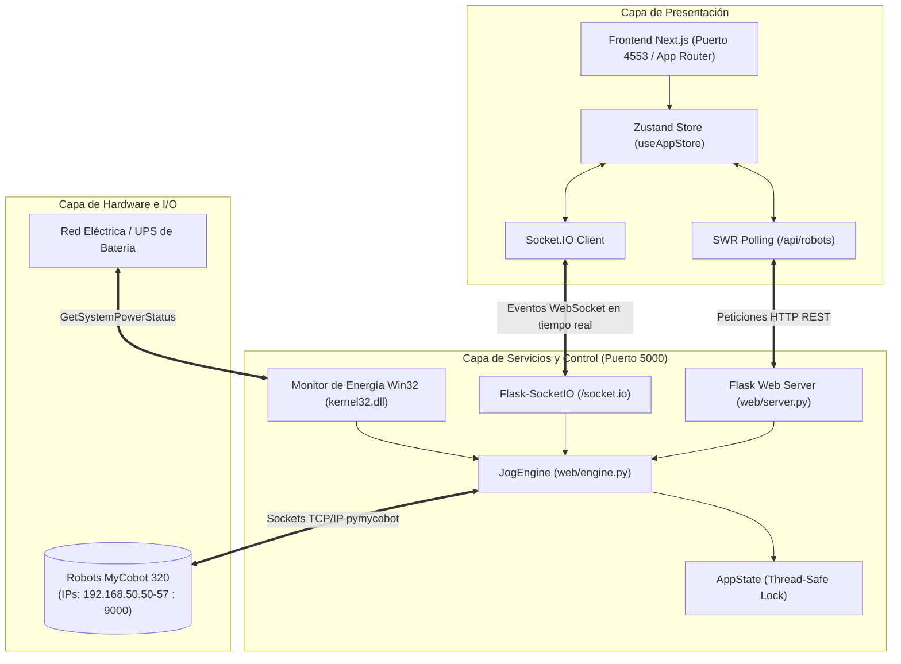

# Robot Control System — Cobot 320

Sistema de control industrial distribuido, monitoreo en tiempo real y ejecución de secuencias para celdas robotizadas multi-brazo de hasta 8 robots colaborativos **Elephant Robotics MyCobot 320**.

El proyecto cuenta con una arquitectura desacoplada Cliente-Servidor que integra un motor de control multihilo en Python con comunicación TCP/IP directa a los robots, detección de fallos de alimentación (UPS) mediante la API Win32 de Windows, un servidor de servicios REST y WebSockets con Flask-SocketIO, y una interfaz de usuario web moderna desarrollada en Next.js, React y TypeScript.

---

## Índice

1. [Tecnologías y Stack Tecnológico](#tecnologías-y-stack-tecnológico)
2. [Estructura del Proyecto](#estructura-del-proyecto)
3. [Arquitectura del Sistema](#arquitectura-del-sistema)
4. [Decisiones de Diseño](#decisiones-de-diseño)
5. [Comandos de Instalación y Ejecución](#comandos-de-instalación-y-ejecución)
6. [Catálogo de APIs](#catálogo-de-apis)
   - [Endpoints REST (HTTP)](#endpoints-rest-http)
   - [Eventos WebSocket (Socket.IO)](#eventos-websocket-socketio)
7. [Funcionamiento de la Aplicación](#funcionamiento-de-la-aplicación)
   - [Gestión y Conexión Multi-Robot](#1-gestión-y-conexión-multi-robot)
   - [Jogging Manual (Articular y Cartesiano)](#2-jogging-manual-articular-y-cartesiano)
   - [Enseñanza y Gestión de Recetas (Teach & Repeat)](#3-enseñanza-y-gestión-de-recetas-teach--repeat)
   - [Motor de Secuencias y Parada de Emergencia](#4-motor-de-secuencias-y-parada-de-emergencia)
   - [Sistema de Protección Eléctrica (UPS Monitor)](#5-sistema-de-protección-eléctrica-ups-monitor)
8. [Configuración y Persistencia](#configuración-y-persistencia)

---

## Tecnologías y Stack Tecnológico

El proyecto está compuesto por capas especializadas:

### Backend y Control Industrial
- **Lenguaje**: Python 3.10+
- **Servidor Web & API**: Flask 3.x
- **Comunicación en Tiempo Real**: Flask-SocketIO con motor asíncrono threading (`async_mode="threading"`).
- **SDK Robótica**: `pymycobot` (`MyCobot320Socket`) para control cinemático sobre TCP/IP (puerto 9000 por defecto).
- **Integración con Sistema Operativo (Windows)**: Módulo nativo `ctypes` enlazado a `kernel32.dll` (`GetSystemPowerStatus`) para monitoreo de batería y cortes de línea AC.
- **Concurrencia**: Hilos nativos (`threading.Thread`) y primitivas de sincronización (`threading.Lock`) para proteger el estado global del sistema de forma thread-safe.
- **Capa Legacy / Core**: PyQt6 (`QtCore`, `QThread`, `QObject`, `pyqtSignal`) de la primera generación de la aplicación de escritorio.

### Frontend Moderno (`frontend-next/`)
- **Framework**: [Next.js 16](https://nextjs.org/) (App Router).
- **Librería UI**: [React 18](https://react.dev/).
- **Lenguaje**: [TypeScript 5](https://www.typescriptlang.org/).
- **Estilos**: [Tailwind CSS 3.4](https://tailwindcss.com/) con paleta industrial personalizada (tema claro, estados cromáticos para robots y UPS).
- **Gestor de Estado Global**: [Zustand 5](https://zustand-demo.pmnd.rs/) (`useAppStore`) para manejo reactivo de robots, logs, recetas, tabs y parámetros.
- **Caché y Data Fetching**: [SWR 2.4](https://swr.vercel.app/) para sondeo periódico del estado de robots.
- **Cliente WebSocket**: [Socket.IO Client 4.8](https://socket.io/) (`socket.io-client`) para telemetría bidireccional inmediata.

### Frontend Alternativo / Standalone (`web/frontend/`)
- Interfaz ligera en HTML5 semántico, Vanilla CSS y JavaScript puro con cliente Socket.IO para despliegues embebidos directos servidos desde Flask.

---

## Estructura del Proyecto

```text
Robots/
├── core/                               # Módulos base heredados (PyQt6 / QThread)
│   ├── __init__.py
│   ├── connection.py                   # Worker QObject para conexión socket MyCobot
│   ├── robot_runner.py                 # Orquestador QObject de secuencias forward/reverse
│   └── ups_monitor.py                  # Hilo QThread para sondeo Win32 GetSystemPowerStatus
│
├── web/                                # Capa de servicios backend y servidor web
│   ├── __init__.py
│   ├── engine.py                       # JogEngine y AppState: Motor central desacoplado
│   ├── server.py                       # Servidor Flask, SocketIO y declaración de rutas REST
│   └── frontend/                       # Interfaz estática standalone (HTML5 / Vanilla JS)
│       ├── app.js                      # Lógica de interfaz cliente standalone
│       ├── index.html                  # Marcado de interfaz con 3 pestañas
│       └── style.css                   # Sistema de diseño CSS para cliente standalone
│
├── frontend-next/                      # Frontend moderno en Next.js + React + TypeScript
│   ├── app/
│   │   ├── globals.css                 # Estilos globales y variables de tema
│   │   ├── layout.tsx                  # Layout principal HTML/Body
│   │   └── page.tsx                    # Punto de entrada que renderiza AppShell2
│   ├── components/
│   │   ├── AppHeader.tsx               # Encabezado con estado general, logo y estado UPS
│   │   ├── AppShell.tsx                # Contenedor con pestañas horizontales
│   │   ├── AppShell2.tsx               # Contenedor actual con barra de navegación lateral
│   │   ├── UpsBanner.tsx               # Notificación flotante de corte de energía eléctrica
│   │   ├── tabs/
│   │   │   ├── MainTab.tsx             # Panel de inicio/parada y estado de los 8 robots
│   │   │   ├── JoggingTab.tsx          # Panel de teleoperación manual (Joint/Cartesian)
│   │   │   ├── RecipeTab.tsx           # Editor y gestor de recetas y coordenadas de puntos
│   │   │   └── ConfigTab.tsx           # Configuración de IPs y parámetros generales
│   │   └── ui/
│   │       ├── Badge.tsx               # Badges de estado (conectado, error, conectando)
│   │       ├── JogButton.tsx           # Botón de incremento/decremento cinemático
│   │       ├── LogBox.tsx              # Consola de registro de eventos con autoscroll
│   │       ├── ProgressBar.tsx         # Barra de progreso visual por pasos de secuencia
│   │       └── StatusDot.tsx           # Indicador puntual luminoso de conectividad
│   ├── hooks/
│   │   ├── useAppStore.ts              # Store global de Zustand (Robots, Jog, Recetas, Logs)
│   │   ├── useRobotPosition.ts         # Hook para sondeo continuo de ángulos/coordenadas
│   │   ├── useRobots.ts                # Hook SWR para sincronización de lista de robots
│   │   └── useSocket.ts                # Conexión persistente Socket.IO y despacho a store
│   ├── lib/
│   │   └── api.ts                      # Capa tipada de llamadas fetch hacia los endpoints REST
│   ├── types/
│   │   └── index.ts                    # Interfaces TypeScript (Robot, Point, RecipeData, etc.)
│   ├── next.config.js                  # Proxy de desarrollo para rewrites hacia Flask (:5000)
│   ├── package.json                    # Dependencias y scripts de Node.js
│   ├── tailwind.config.ts              # Configuración de Tailwind y tokens de diseño
│   └── tsconfig.json                   # Configuración del compilador TypeScript
│
├── recipes/                            # Repositorio de trayectorias persistidas en formato JSON
│   ├── Test Recipe.json                # Receta de prueba con puntos 'Home'
│   └── Testing.json                    # Receta con secuencias de puntos por robot
│
├── main_web.py                         # Punto de entrada principal para arrancar el backend
├── robots_IPS.json                     # Archivo de configuración de red y parámetros cinemáticos
├── Robot_Control.spec                  # Archivo de especificación de empaquetado PyInstaller
├── resourceTest.qrc                    # Definición de recursos compilados Qt (QRC)
├── robot_full_interface_v2.html        # Prototipo inicial / referencia visual HTML
├── implementation_plan.md              # Documentación de análisis y refactorización técnica
└── README.md                           # Documentación técnica principal del proyecto
```

---

## Arquitectura del Sistema

El sistema implementa una arquitectura desacoplada de 3 capas:



### Flujo de Datos y Eventos
1. **Comandos (Unidireccional HTTP)**: Acciones intencionales del usuario (Jogging, Guardar Receta, Conectar Robot, Iniciar Secuencia) se transmiten como peticiones `POST`/`PUT`/`DELETE` vía REST API.
2. **Telemetría y Estado (Bidireccional WebSocket)**: Los cambios de estado de robots, las alertas de energía eléctrica, los logs del sistema y el progreso paso a paso de cada secuencia se emiten desde `JogEngine` mediante eventos WebSocket hacia el cliente React.
3. **Persistencia Local**: Tanto las recetas de puntos como los parámetros de conexión se almacenan en el sistema de archivos local (`recipes/*.json` y `robots_IPS.json`), garantizando independencia de gestores de bases de datos pesados.

---

## Decisiones de Diseño

### 1. Migración de Desktop Monolítico (PyQt6) a Cliente-Servidor Web
- **Motivo**: La versión original (`Robot_Control.py`) agrupaba en una única clase de interfaz de más de 1000 líneas la gestión de la GUI, hilos de sockets de red, llamadas cinemáticas y la manipulación de archivos.
- **Solución**: Se separó la lógica de hardware en un motor independiente (`JogEngine`) y una API Web estándar (Flask + Next.js). Esto permite operar la celda robótica desde tabletas industriales, múltiples pantallas de operadores o estaciones remotas a través de un navegador web sin requerir instalación de entornos gráficos locales en cada terminal.

### 2. Thread-Safety con `AppState` y Bloqueos de Concurrencia
- En entornos industriales donde hasta 8 robots ejecutan movimientos simultáneamente o son consultados en paralelo por la telemetría, `AppState` utiliza un `threading.Lock` para encapsular las lecturas y escrituras sobre los diccionarios de robots, evitando condiciones de carrera (`race conditions`).

### 3. Conexión de Robots No Bloqueante
- Al invocar `/api/robots/<id>/connect`, la conexión TCP/IP hacia el controlador del robot se lanza en un hilo secundario en segundo plano (`daemon=True`). El backend responde de inmediato con estado `"connecting"`, y emite el evento `"robot_status"` por WebSocket cuando la conexión se establece o falla. De este modo, la interfaz gráfica nunca se congela ante timeouts de red.

### 4. Parada de Emergencia Inteligente con Retracción Inversa (`run_reverse`)
- Una parada de emergencia en robots manipuladores que operan dentro de matrices de ensamblaje no debe simplemente desenergizar los servos, ya que la gravedad o la inercia pueden colisionar los efectores finales.
- El sistema implementa una rutina de detención donde los robots revierten la secuencia de puntos ya transitados (`sequence_points.reverse()`) de forma controlada a velocidad segura (50%) para devolver el brazo a su punto de inicio o posición segura de despeje.

### 5. Monitoreo de Alimentación Integrado a Nivel Sistema Operativo
- Mediante la estructura de bajo nivel `SystemPowerStatus` de la librería `ctypes` de Windows, el hilo de monitoreo detecta si la estación pasó a funcionar en batería. Si se detecta un corte en la línea de corriente (`ACLineStatus == 0`), el sistema aborta de inmediato las secuencias activas para prevenir movimientos incompletos por apagones bruscos.

### 6. Sistema de Proxy Reverso en Desarrollo
- Para evitar problemas de CORS y simplificar el desarrollo, `next.config.js` implementa reescrituras automáticas (`rewrites`):
  - `/api/:path*` ➔ `http://127.0.0.1:5000/api/:path*`
  - `/socket.io/:path*` ➔ `http://127.0.0.1:5000/socket.io/:path*`

---

## Comandos de Instalación y Ejecución

### Requisitos Previos
- **Sistema Operativo**: Windows 10/11 (necesario para el módulo nativo de monitoreo de UPS con `kernel32.dll`).
- **Python**: Versión 3.10 o superior con `pip`.
- **Node.js**: Versión 18.x o superior con `npm`.

---

### Paso 1: Instalación de Dependencias del Backend

Abre una terminal PowerShell o CMD en la raíz del proyecto (`Robots/`):

```powershell
# (Opcional pero recomendado) Crear y activar entorno virtual
python -m venv venv
.\venv\Scripts\Activate.ps1

# Instalar dependencias del servidor y robótica
pip install flask flask-socketio pymycobot pyqt6
```

> **Nota**: `pymycobot` requiere soporte para sockets de red. Si estás ejecutando en un entorno de desarrollo sin robots físicos conectados, `JogEngine` detectará la ausencia de hardware o de la librería e indicará el error en la interfaz sin detener el servidor.

---

### Paso 2: Instalación de Dependencias del Frontend

En otra terminal, dirígete a la carpeta `frontend-next/`:

```powershell
cd frontend-next
npm install
```

---

### Paso 3: Ejecución de la Aplicación

Debes iniciar el servidor backend y el servidor de la interfaz web:

#### Terminal 1 — Iniciar Backend (Flask + SocketIO en puerto 5000):
```powershell
# Desde la raíz del proyecto (Robots/)
python main_web.py
```
*Salida esperada:*
```text
  Robot Control Web Interface
  Running at: http://127.0.0.1:5000
  Press Ctrl+C to stop
```

#### Terminal 2 — Iniciar Frontend Next.js (en puerto 4553):
```powershell
# Desde frontend-next/
npm run dev
```
*Salida esperada:*
```text
  ▲ Next.js 16.2.4
  - Local:        http://localhost:4553
  - Network:      http://<tu-ip>:4553
```

Una vez iniciados ambos servicios, abre tu navegador web en:
👉 **`http://localhost:4553`**

---

### Otros Scripts de Frontend

Dentro del directorio `frontend-next/`:
- `npm run build`: Compila la aplicación de producción optimizada.
- `npm run start`: Inicia el servidor Next.js en modo producción en el puerto 4553.
- `npm run serve`: Ejecuta la compilación y posterior arranque en modo producción en un solo paso.
- `npm run lint`: Ejecuta el análisis estático de código con ESLint.

---

## Catálogo de APIs

El backend expone una API REST bajo el prefijo `/api` y un canal en tiempo real mediante WebSockets bajo `/socket.io`.

### Endpoints REST (HTTP)

#### 1. Gestión de Robots

| Método | Endpoint | Descripción | Body (JSON) | Respuesta Exitosa |
|---|---|---|---|---|
| `GET` | `/api/robots` | Lista el estado y la IP de los 8 robots. | Ninguno | `[ { "id": 1, "ip": "192.168.50.50", "status": "connected", "connected": true, "error": "" }, ... ]` |
| `POST` | `/api/robots/<id>/connect` | Inicia hilo de conexión TCP hacia el robot especificado. | Ninguno | `{ "success": true, "message": "Connecting to Robot 1..." }` |
| `GET` | `/api/robots/<id>/position` | Consulta los ángulos y coordenadas cartesianas actuales del robot. | Ninguno | `{ "angles": [0,0,0,0,0,0], "coords": [0,0,0,0,0,0], "connected": true }` |
| `POST` | `/api/robots/<id>/jog` | Envía un movimiento manual incremental a un eje o articulación. | Ver detalle abajo | `{ "success": true }` |
| `POST` | `/api/robots/<id>/release` | Desenergiza y libera todos los servomotores (modo libre). | Ninguno | `{ "success": true }` |
| `POST` | `/api/robots/<id>/focus` | Energiza y fija todos los servomotores del robot. | Ninguno | `{ "success": true }` |
| `POST` | `/api/robots/<id>/teach` | Graba la posición angular actual del robot en una receta y punto dados. | Ver detalle abajo | `{ "success": true, "angles": [10.5, 0, ...] }` |
| `POST` | `/api/robots/<id>/goto` | Mueve el robot directamente a las coordenadas del punto de la receta. | Ver detalle abajo | `{ "success": true }` |

##### Payload de Jogging (`POST /api/robots/<id>/jog`):
```json
{
  "mode": "joint",        // "joint" (articular) o "cartesian" (cartesiano)
  "axis": "J1",           // "J1"-"J6" si es joint; "X", "Y", "Z", "Rx", "Ry", "Rz" si es cartesian
  "direction": 1,         // 1 para incremento positivo, -1 para decremento
  "step": 5.0,            // Magnitud del desplazamiento en grados o mm
  "speed": 15             // Velocidad del movimiento (1 - 100)
}
```

##### Payload de Enseñanza (`POST /api/robots/<id>/teach`):
```json
{
  "recipe": "Testing",
  "point": "Punto de Toma"
}
```

##### Payload de Traslado a Punto (`POST /api/robots/<id>/goto`):
```json
{
  "recipe": "Testing",
  "point": "Punto de Toma",
  "speed": 25
}
```

---

#### 2. Gestión de Recetas

| Método | Endpoint | Descripción | Body (JSON) | Respuesta Exitosa |
|---|---|---|---|---|
| `GET` | `/api/recipes` | Retorna el listado de nombres de recetas guardadas. | Ninguno | `[ "Test Recipe", "Testing" ]` |
| `POST` | `/api/recipes` | Crea una receta nueva inicializada con puntos 'Home' para 8 robots. | `{ "name": "Nueva Receta" }` | `{ "success": true }` |
| `GET` | `/api/recipes/<nombre>` | Obtiene el contenido completo de coordenadas de una receta. | Ninguno | `{ "Robot 1": [ { "name": "Home", "coords": [0,0,0,0,0,0] } ], ... }` |
| `PUT` | `/api/recipes/<nombre>` | Sobrescribe la estructura completa de puntos de la receta. | Estructura `RecipeData` | `{ "success": true }` |
| `DELETE` | `/api/recipes/<nombre>` | Elimina el archivo JSON de la receta del disco. | Ninguno | `{ "success": true }` |

---

#### 3. Control de Secuencias Automáticas

| Método | Endpoint | Descripción | Body (JSON) | Respuesta Exitosa |
|---|---|---|---|---|
| `POST` | `/api/sequence/start` | Inicia la secuencia completa de la receta seleccionada en los robots conectados. | `{ "recipe": "Testing", "speed": 30 }` | `{ "success": true }` |
| `POST` | `/api/sequence/stop` | Detiene inmediatamente la secuencia y ejecuta retracción inversa segura. | Ninguno | `{ "success": true }` |

---

#### 4. Configuración y Estado Global

| Método | Endpoint | Descripción | Body (JSON) | Respuesta Exitosa |
|---|---|---|---|---|
| `GET` | `/api/config` | Obtiene la configuración de red (`ips`) y parámetros generales. | Ninguno | `{ "ips": { "Robot_1": "192.168.50.50", ... }, "general_params": { ... } }` |
| `POST` | `/api/config` | Guarda y persiste las nuevas IPs y parámetros en `robots_IPS.json`. | Estructura completa de config | `{ "success": true }` |
| `GET` | `/api/status` | Devuelve el estado de la secuencia activa, estado del UPS y últimos logs. | Ninguno | `{ "sequence_running": false, "ups_status": "ac", "log": [ ... ] }` |

---

### Eventos WebSocket (Socket.IO)

El servidor Flask emite eventos asíncronos hacia todos los clientes suscritos:

| Evento | Dirección | Descripción | Estructura del Payload |
|---|---|---|---|
| `connect` | Servidor ➔ Cliente | Conexión WebSocket establecida con éxito. | — |
| `disconnect` | Servidor ➔ Cliente | Pérdida de enlace con el servidor de sockets. | — |
| `robot_status` | Servidor ➔ Cliente | Notificación de cambio de estado de un robot. | `{ "robot_id": 1, "status": "connected", "ip": "192.168.50.50", "error": "" }` |
| `sequence_progress`| Servidor ➔ Cliente | Telemetría del progreso de ejecución por robot. | `{ "robot_id": 1, "step": 3, "total": 6, "status": "Moving" }` |
| `sequence_done` | Servidor ➔ Cliente | Notifica que la receta finalizó en todos los robots. | `{ "recipe": "Testing" }` |
| `log` | Servidor ➔ Cliente | Nueva entrada en la bitácora del sistema. | `{ "level": "ok", "message": "[OK] Robot 1 connected", "ts": "11:34:00" }` |
| `ups_alert` | Servidor ➔ Cliente | Alerta de corte de energía o restauración de red. | `{ "type": "lost", "battery": 85 }` o `{ "type": "restored" }` |

---

## Funcionamiento de la Aplicación

La aplicación se opera principalmente desde la interfaz web organizada en 4 pestañas:

```text
┌────────────────────────────────────────────────────────────────────────┐
│  ⚙ Robot Control — Elephant Robotics Cobot 320     ⚡ UPS OK  ● Robot 1 │
├──────────┬─────────────────────────────────────────────────────────────┤
│ ▶ Main   │  Controles de Secuencia: [Receta ▼] [Velocidad ──●─]         │
│          │  [▶ Iniciar]  [◼ Detener]                                   │
│ 🕹 Jog   │  Tabla de estado y barras de progreso de Robots 1 a 8        │
│          ├─────────────────────────────────────────────────────────────┤
│ 📋 Recetas│  Selección Robot | Modo: (Articular / Cartesiano)           │
│          │  Paso: [1] [5] [10] [50]  |  Matriz de Botones [+ / -]      │
│ ⚙ Config │  Lectura de Coordenadas | Liberar/Energizar | Enseñar Punto │
└──────────┴─────────────────────────────────────────────────────────────┘
```

### 1. Gestión y Conexión Multi-Robot
- El sistema soporta un arreglo fijo de hasta **8 brazos robóticos** (`Robot 1` a `Robot 8`).
- En la pestaña **Configuración**, el operador puede definir las direcciones IP estáticas de cada robot (por defecto en el rango `192.168.50.50` a `192.168.50.57`).
- Al pulsar **Conectar**, el backend establece una sesión de socket TCP por el puerto `9000`, alimenta los servomotores con `power_on()` y limpia errores previos con `clear_error_information()`.
- La interfaz visualiza el estado mediante insignias cromáticas (`Conectado`, `Desconectado`, `Conectando...`, `Error`).

### 2. Jogging Manual (Articular y Cartesiano)
- En la pestaña **Jogging**, el operador selecciona el robot a controlar.
- **Modo Articular (`joint`)**:
  - Control individual de las articulaciones **J1** a **J6** en grados sexagesimales (°).
  - Rango de paso seleccionable: `1°`, `5°`, `10°` o `50°`.
- **Modo Cartesiano (`cartesian`)**:
  - Control de coordenadas en el espacio tridimensional: ejes de traslación **X**, **Y**, **Z** (en milímetros) y orientación de la herramienta **Rx**, **Ry**, **Rz** (en grados).
- **Manejo de Servos**:
  - **Liberar servos**: Apaga el torque de los motores con `release_all_servos()` permitiendo mover el brazo manualmente con la mano.
  - **Fijar servos**: Restablece el torque y fija la posición con `focus_all_servos()`.
- **Telemetría en Vivo**: El hook `useRobotPosition` consulta periódicamente la cinemática del robot actualizando la tabla de ángulos y coordenadas en tiempo real.

### 3. Enseñanza y Gestión de Recetas (Teach & Repeat)
- **Enseñanza Rápida (Desde Pestaña Jogging)**:
  - El usuario posiciona el robot (ya sea mediante jog o guiado manual con servos liberados).
  - Selecciona la receta destino, escribe un nombre de punto (o selecciona uno existente para sobrescribir) y presiona **Enseñar posición**.
  - El sistema lee los ángulos instantáneos con `mc.get_angles()` y los graba de inmediato en el archivo JSON de la receta.
  - El botón **Ir al punto** permite comprobar la posición moviendo el robot al punto grabado.
- **Editor Completo (Pestaña Recetas)**:
  - Permite crear nuevas recetas, eliminarlas o inspeccionar las coordenadas exactas de cada robot.
  - Tabla editable de puntos con funciones para añadir, eliminar, subir o bajar el orden de la trayectoria.

### 4. Motor de Secuencias y Parada de Emergencia
- Desde la pestaña **Main**, el operador selecciona una receta y la velocidad de operación (1% a 100%).
- Al hacer clic en **Iniciar**:
  - El motor `JogEngine.start_sequence()` ejecuta en un hilo asíncrono el recorrido de puntos secuencialmente para cada uno de los robots conectados.
  - Por cada punto, envía los ángulos con `send_angles()` y monitorea en bucle si el robot sigue en movimiento mediante `is_moving()`.
  - Emite eventos `sequence_progress` actualizando el paso actual y las barras de progreso visuales en la interfaz.
- Al hacer clic en **Detener**:
  - Se activa `stop_sequence()`.
  - El sistema envía la orden de parada `stop()`, recupera el historial de puntos recorridos (`sequence_points`) e invierte su orden para regresar al robot a su posición original de forma suave y controlada, evitando paradas a mitad de recorrido.

### 5. Sistema de Protección Eléctrica (UPS Monitor)
- El hilo continuo `_start_ups_monitor()` consulta cada 1 segundo la función del núcleo de Windows `GetSystemPowerStatus`.
- Si se detecta un corte en la línea eléctrica principal:
  1. El backend actualiza `ups_status = "battery"`.
  2. Si hay una secuencia de robots en ejecución, se aborta inmediatamente llamando a `stop_sequence()`.
  3. Se emite el evento WebSocket `ups_alert` con el porcentaje restante de la batería.
  4. En el frontend aparece inmediatamente un banner rojo flotante persistente (`UpsBanner`) y el indicador del header cambia a modo de advertencia parpadeante.
- Cuando la corriente eléctrica se reestablece, se emite la notificación de restauración y el sistema vuelve a estado nominal.

---

## Configuración y Persistencia

### Archivo `robots_IPS.json`
Ubicado en la raíz del proyecto, define las direcciones de red y los límites de la celda:

```json
{
    "ips": {
        "Robot_1": "192.168.50.50",
        "Robot_2": "192.168.50.51",
        "Robot_3": "192.168.50.52",
        "Robot_4": "192.168.50.53",
        "Robot_5": "192.168.50.54",
        "Robot_6": "192.168.50.55",
        "Robot_7": "192.168.50.56",
        "Robot_8": "192.168.50.57"
    },
    "general_params": {
        "maxSpeed": 100,
        "acceleration": 200,
        "timeout": 5,
        "retries": 3,
        "port": 9000
    }
}
```

### Formato de Recetas (`recipes/<nombre>.json`)
Cada receta es un archivo JSON indexado por clave de robot (`"Robot 1"` ... `"Robot 8"`), conteniendo una lista ordenada de objetos punto con 6 valores angulares (J1 a J6):

```json
{
    "Robot 1": [
        {
            "name": "Home",
            "coords": [ 0.0, 0.0, 0.0, 0.0, 0.0, 0.0 ]
        },
        {
            "name": "Pick_Position",
            "coords": [ 45.2, -30.0, 15.4, 0.0, -45.0, 10.0 ]
        }
    ]
}
```

---

## Servicio de cámaras iRAYPLE

El servicio `camera-service` es un proceso Rust independiente. Obtiene la configuración vigente de robots mediante `GET /api/config` del backend Python y conserva solamente las asignaciones `robot_ip` ↔ `camera_serial` en SQLite. No modifica el archivo `robots_IPS.json` ni los endpoints de control.

El SDK se integra contra `MVSDKmd.lib` x64 y la captura usa un hilo exclusivo por cámara. Cada hilo conserva únicamente el JPEG más reciente mediante un canal acotado; los clientes MJPEG no crean handles adicionales del SDK.

1. Copia `camera-service/.env.example` a `camera-service/.env` y ajusta las rutas o puertos necesarios.
2. Asegura que `MVSDKmd.dll` esté accesible en `PATH` o junto al ejecutable. Si el SDK está instalado en otra ubicación, configura `IRAYPLE_SDK_DIR` al directorio `Development`.
3. Ejecuta `cargo run` desde `camera-service`.
4. Ejecuta `npm run dev` desde `frontend-next`.

El frontend reenvía `/camera-service/*` a `http://127.0.0.1:5001/*`. La pestaña Cámaras permite detectar dispositivos, iniciar/detener captura y asignar una cámara a un robot usando su identificador lógico, por ejemplo `Robot_1`.

La detección del SDK y la compilación se validaron en Windows x64. No se validó captura con cámaras físicas durante esta integración.

## Backend Python en Docker

El backend se construye desde `Dockerfile` con Python 3.14, Flask 3.1.2, Flask-SocketIO 5.6.1 y pymycobot 4.0.4. Conserva el comando de inicio `python main_web.py`; `HOST` y `PORT` mantienen sus valores locales predeterminados y Compose los configura como `0.0.0.0:5000` para publicar el servicio.

Los archivos `robots_IPS.json` y el directorio `recipes/` se montan desde el host. Deben existir antes de iniciar Compose y permanecen como la fuente de verdad de la configuración y recetas.

```powershell
docker compose build backend
docker compose up -d backend
docker compose logs -f backend
docker compose ps
docker compose exec backend python -c "import urllib.request; print(urllib.request.urlopen('http://127.0.0.1:5000/api/status').read().decode())"
```

`docker compose up -d --build` inicia también el frontend Next.js en `http://localhost:4553`. El contenedor frontend envía `/api` y `/socket.io` al servicio `backend` por `robot-network`, sin exponer la red de control al navegador.

El servicio Rust de cámaras se ejecuta en Windows host porque el SDK iRAYPLE proporcionado usa `MVSDKmd.dll` x64. Desde el frontend container se accede a través de `host.docker.internal:5001`; configura `CAMERA_SERVICE_URL` si se ejecuta en otro host o puerto. Docker Desktop en modo Linux no puede cargar una DLL de Windows, y los contenedores Windows no se pueden combinar con los servicios Linux de este Compose en el mismo modo de daemon.

Para usar rutas de persistencia distintas en Windows, define `ROBOT_CONFIG_PATH` y `RECIPES_PATH` en la sesión de PowerShell antes de ejecutar Compose. El backend queda disponible internamente como `http://backend:5000`; por ello, un futuro contenedor de `camera-service` debe usar `ROBOT_BACKEND_URL=http://backend:5000` y conectarse a la red `robot-network`.

Los robots se comunican por TCP con las IP configuradas y puerto 9000. Docker Desktop debe tener salida hacia `192.168.50.0/24`; no se puede garantizar desde el host Windows. Diagnostica desde el contenedor con:

```powershell
docker compose exec backend python -c "import socket; print(socket.create_connection(('192.168.50.50', 9000), 3).getpeername())"
```

Si falla, valida primero la ruta y firewall desde Windows, después la configuración de red de Docker Desktop. No cambies las IPs de `robots_IPS.json` para compensar una ruta de red inaccesible.

## Licencia y Mantenimiento

Proyecto desarrollado para control y automatización de celdas robóticas industriales con Elephant Robotics Cobot 320.
Todos los derechos reservados.
